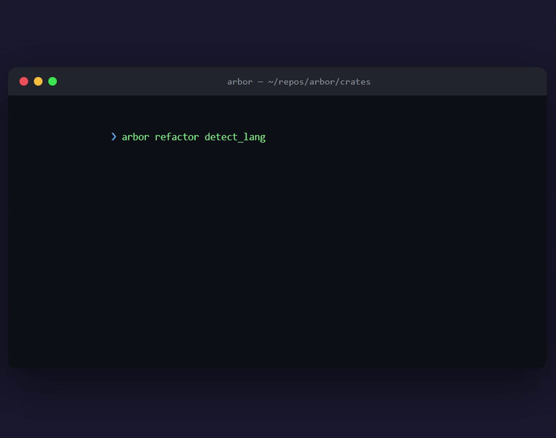
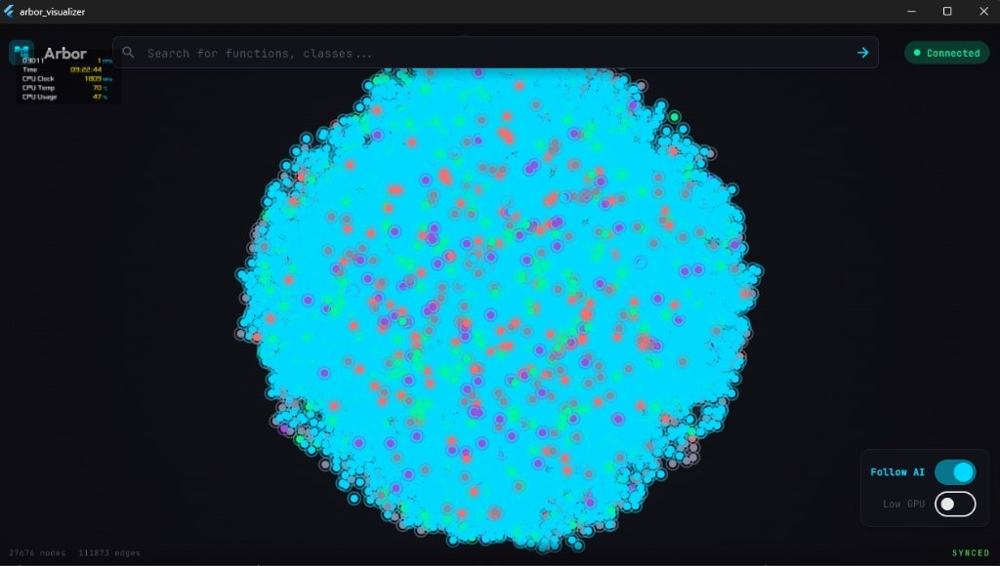

<p align="center">
  
</p>

<h1 align="center">Arbor</h1>

<p align="center">
  <strong>Graph-native intelligence for codebases.</strong><br>
  Know what breaks <em>before</em> you break it.
</p>

<p align="center">
  <a href="https://github.com/Anandb71/arbor/actions"></a>
  <a href="https://crates.io/crates/arbor-graph-cli"></a>
  <a href="https://github.com/Anandb71/arbor/releases"></a>
  <a href="https://github.com/Anandb71/arbor/pkgs/container/arbor"></a>
  <a href="https://glama.ai/mcp/servers/@Anandb71/arbor"></a>
  
</p>

> **v2.4.0 — The Agent-Native Leap** · First code-graph MCP server built for MCP `2026-07-28`. Stateless HTTP, Tasks extension, interactive MCP Apps, real git-diff blast radius, and ~95% fewer tokens than file-reading agents. [Release notes →](docs/RELEASE_NOTES_v2.4.0.md)

---

## Why Arbor

Most AI coding tools treat code as text. Arbor builds a **semantic dependency graph** — functions, classes, and modules as nodes; calls, imports, and inheritance as edges — then answers execution-aware questions with deterministic precision:

| Question | Arbor answer |
|----------|--------------|
| *If I change this symbol, what breaks?* | Blast radius with depth, confidence, and risk level |
| *Who calls this — directly and transitively?* | Caller/callee traversal on the call graph |
| *What's the shortest path between A and B?* | A* path through real dependencies |
| *Is this PR too risky to merge?* | CI gate on blast-radius thresholds |

No keyword guessing. No embedding hallucinations. One graph, every interface.

---

## What's new in v2.4.0

| Feature | What it does |
|---------|--------------|
| **MCP `2026-07-28`** | Stateless `server/discover`, response caching (`ttlMs`/`cacheScope`), dual-version fallback for `2025-03-26` clients |
| **Tasks extension** | `tasks/get` · `tasks/update` · `tasks/cancel` — cold-start indexing returns task handles, not errors |
| **MCP Apps** | Interactive blast-radius graph (`ui://arbor/blast-radius`) and architecture map (`ui://arbor/architecture-map`) inside agent hosts |
| **HTTP transport** | `arbor bridge --http --port 3333` — stateless MCP behind load balancers |
| **Real `get_blast_radius`** | Git-diff-aware impact analysis via shared `arbor-graph::compute_blast_radius` |
| **Pagination** | `offset` / `limit` / `hasMore` on `search_symbols` and `get_map` |
| **Benchmarks** | Criterion suite + CI regression gate — see [BENCHMARKS.md](docs/BENCHMARKS.md) |

---

## Quickstart

```bash
# Install
cargo install arbor-graph-cli

# Index your project (one command)
cd your-project && arbor setup

# Explore before you edit
arbor map . --exclude-test          # ranked project skeleton (~1k tokens)
arbor refactor parse_file           # blast radius of changing a symbol
arbor diff                          # impact of uncommitted git changes

# Wire up your AI agent
claude mcp add --transport stdio --scope project arbor -- arbor bridge
```

**Agent workflow:** call `get_map` first → `search_symbols` / `get_file_graph` to locate code → `Read` only the target file. [Full MCP guide →](docs/MCP_INTEGRATION.md)

---

## For AI agents (MCP)

Arbor ships a production MCP server via `arbor bridge`. Stdio is the default; HTTP is opt-in for remote/enterprise.

```bash
# Stdio (Claude, Cursor, VS Code)
arbor bridge

# HTTP (MCP 2026-07-28)
arbor bridge --http --port 3333
```

### Cursor / VS Code

```json
{
  "mcpServers": {
    "arbor": {
      "type": "stdio",
      "command": "arbor",
      "args": ["bridge"]
    }
  }
}
```

Templates: [`templates/mcp/`](templates/mcp/) · Setup scripts: `scripts/setup-mcp.sh` · `scripts/setup-mcp.ps1`

### 16 MCP tools

| Tier | Tools | Use when |
|------|-------|----------|
| **Orientation** | `get_map` | First call — token-budgeted project skeleton ranked by PageRank |
| **Surgical** | `list_entry_points` · `get_callers` · `get_callees` · `search_symbols` · `get_file_graph` · `get_node_detail` | Navigate to a specific symbol or file |
| **Broad** | `get_logic_path` · `analyze_impact` · `find_path` · `get_knowledge_path` | Trace dependencies, blast radius, paths |
| **Agent-native** | `get_blast_radius` · `explain_symbol` · `audit_security` · `get_architecture_overview` · `batch_query` | PR impact, onboarding, security audit, bulk lookup |

Every tool returns `{ ok, tool, data, meta: { suggested_next_tool, suggested_next_args } }` so agents chain calls without re-prompting.

**Registry:** `io.github.Anandb71/arbor` · [Official API lookup](https://registry.modelcontextprotocol.io/v0.1/servers?search=io.github.Anandb71/arbor) · [Glama listing](https://glama.ai/mcp/servers/@Anandb71/arbor)

---

## CLI reference

| Command | Description |
|---------|-------------|
| `arbor setup` | One-shot init + index |
| `arbor map` | Ranked, token-budgeted project skeleton |
| `arbor query <term>` | Fuzzy symbol search (supports `\|` OR) |
| `arbor callers / callees <sym>` | One-hop graph traversal |
| `arbor entry-points` | HTTP handlers, main, jobs, webhooks |
| `arbor file-graph <path>` | Symbols + edges in one file |
| `arbor inspect <sym>` | Full symbol detail |
| `arbor path <a> <b>` | Shortest call-graph path |
| `arbor refactor <sym>` | Blast radius before refactoring |
| `arbor diff` | Git-change impact report |
| `arbor check` | CI safety gate (`--max-blast-radius N`) |
| `arbor summary` | Auto-generate PR description |
| `arbor agent review` | Autonomous PR architecture review |
| `arbor agent onboard` | Codebase onboarding guide |
| `arbor agent guard` | Real-time architectural safety gate |
| `arbor bridge` | MCP server (add `--http` for HTTP transport) |
| `arbor watch` | Live re-index on file changes |
| `arbor gui` | Native desktop UI |

All query commands support `--json`. `map` additionally supports `--tokens N`, `--focus "pattern"`, `--focus-changed`.

---

## Visual tour

<p align="center">
  
</p>

<p align="center">
  
</p>

Full recording: [media/recording-2026-01-13.mp4](media/recording-2026-01-13.mp4)

---

## Installation

```bash
# Rust / Cargo
cargo install arbor-graph-cli

# Homebrew (macOS/Linux)
brew install Anandb71/tap/arbor

# Scoop (Windows)
scoop bucket add arbor https://github.com/Anandb71/arbor && scoop install arbor

# npm wrapper (cross-platform)
npx @anandb71/arbor-cli

# Docker
docker pull ghcr.io/anandb71/arbor:latest
```

No-Rust installers:

- macOS/Linux: `curl -fsSL https://raw.githubusercontent.com/Anandb71/arbor/main/scripts/install.sh | bash`
- Windows: `irm https://raw.githubusercontent.com/Anandb71/arbor/main/scripts/install.ps1 | iex`

Pinned installs: [docs/INSTALL.md](docs/INSTALL.md)

---

## Language support

**Production parsers:** Rust · TypeScript / JavaScript · Python · Go · Java · C / C++ · C# · Dart

**Fallback parsers:** Kotlin · Swift · Ruby · PHP · Shell

[Adding languages →](docs/ADDING_LANGUAGES.md)

---

## CI & pull requests

```bash
arbor diff --markdown
arbor check --max-blast-radius 30 --markdown
arbor summary
```

GitHub Action (pre-built binary, ~5s vs ~3–5min compile):

```yaml
name: Arbor Check
on: [pull_request]

jobs:
  arbor:
    runs-on: ubuntu-latest
    steps:
      - uses: actions/checkout@v4
        with:
          fetch-depth: 0

      - uses: Anandb71/arbor@v2.4.0
        with:
          command: check . --max-blast-radius 30 --markdown
          comment-on-pr: true
          github-token: ${{ secrets.GITHUB_TOKEN }}
```

---

## Architecture

```
arbor-core (Tree-sitter parsing)
    └── arbor-graph (petgraph + PageRank + impact analysis)
            ├── arbor-cli      — CLI + MCP bridge
            ├── arbor-mcp      — MCP protocol server
            ├── arbor-server   — WebSocket JSON-RPC
            ├── arbor-watcher  — incremental file watcher
            └── arbor-gui      — desktop UI
```

**Docs:** [Quickstart](docs/QUICKSTART.md) · [Architecture](docs/ARCHITECTURE.md) · [Graph schema](docs/GRAPH_SCHEMA.md) · [MCP integration](docs/MCP_INTEGRATION.md) · [Benchmarks](docs/BENCHMARKS.md) · [Roadmap](docs/ROADMAP.md) · [Philosophy](PHILOSOPHY.md)

**Release channels:** GitHub Releases · crates.io · GHCR · npm · VS Code / Open VSX · Homebrew · Scoop — [Releasing guide](docs/RELEASING.md)

---

## Philosophy

1. **Consumer first** — beautiful, intuitive, instantly useful
2. **Accessibility second** — works across ecosystems, runs anywhere
3. **Affordability next** — minimal overhead, from laptops to monoliths

Arbor is **local-first**: no mandatory data exfiltration, offline-capable, open source. [Security policy →](SECURITY.md)

---

## Contributing

```bash
cargo build --workspace
cargo test --workspace
cargo clippy --workspace --all-targets --all-features
```

[CONTRIBUTING.md](CONTRIBUTING.md) · [Good first issues](docs/GOOD_FIRST_ISSUES.md) · [Code of conduct](CODE_OF_CONDUCT.md)

---

## Contributors

<!-- CONTRIBUTORS:START -->
<p align="center">
    <a href="https://github.com/Anandb71" title="Anandb71" style="text-decoration:none; margin:6px; display:inline-block;">
        
  </a>
    <a href="https://github.com/holg" title="holg" style="text-decoration:none; margin:6px; display:inline-block;">
        
  </a>
    <a href="https://github.com/cabinlab" title="cabinlab" style="text-decoration:none; margin:6px; display:inline-block;">
        
  </a>
    <a href="https://github.com/Karthiksenthilkumar1" title="Karthiksenthilkumar1" style="text-decoration:none; margin:6px; display:inline-block;">
        
  </a>
    <a href="https://github.com/zacwolfe" title="zacwolfe" style="text-decoration:none; margin:6px; display:inline-block;">
        
  </a>
    <a href="https://github.com/sanjayy-j" title="sanjayy-j" style="text-decoration:none; margin:6px; display:inline-block;">
        
  </a>
    <a href="https://github.com/sathguru07" title="sathguru07" style="text-decoration:none; margin:6px; display:inline-block;">
        
  </a>
</p>
<p align="center"><sub><strong>7 contributors</strong> | <a href="https://github.com/Anandb71/arbor/graphs/contributors">View all</a></sub></p>

<!-- CONTRIBUTORS:END -->

---

## License

MIT — see [LICENSE](LICENSE).
