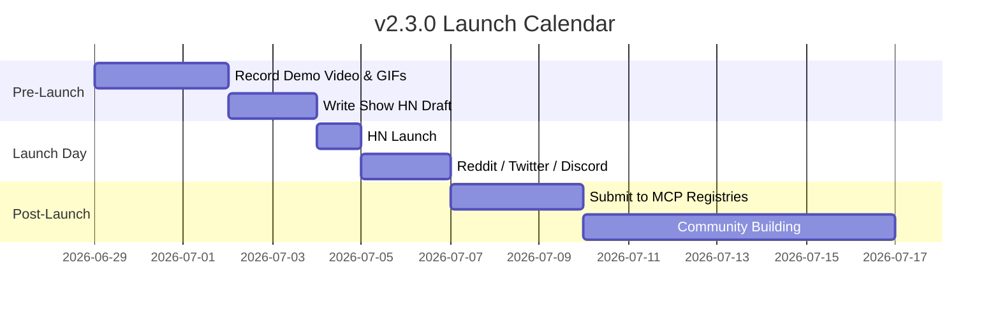

# Arbor v2.4.0 "The Agent-Native Leap" Launch Plan

> **Previous:** [v2.3.0 Launch Plan](LAUNCH_PLAN.md) (archived below)

This document outlines the go-to-market strategy for Arbor v2.4.0, timed with the MCP `2026-07-28` spec release (July 28, 2026).

## Positioning

**"The first code-graph MCP server built for MCP 2026-07-28"**

Unique differentiators:
1. Interactive blast-radius graph rendered **inside** Claude/Cursor via MCP Apps
2. Tasks extension — agents poll indexing progress instead of erroring
3. Stateless HTTP — deploy behind load balancers for enterprise
4. ~95% token savings vs file-reading agents (see `docs/BENCHMARKS.md`)

## Launch Calendar

| Day | Action |
|-----|--------|
| D-7 | Record demo GIF: MCP App graph in agent host |
| D-3 | Publish release notes, update Glama/MCP registry |
| D-0 | Tag `v2.4.0`, post HN/Reddit/X aligned with MCP spec RC |
| D+1 | Follow-up thread with benchmark numbers and token savings |

## Demo Script (60 seconds)

1. `arbor bridge` in project directory
2. Ask agent: "What breaks if I change `parse_file`?"
3. Agent calls `analyze_impact` → **interactive graph appears inline**
4. Ask agent: "What's my blast radius on uncommitted changes?"
5. Agent calls `get_blast_radius` → real git-diff report

## Target Channels

- Hacker News (Show HN)
- r/rust, r/LocalLLaMA, r/programming
- X/Twitter AI tooling community
- MCP Discord / Glama directory
- Dev.to technical deep-dive on token savings

---

# Arbor v2.3.0 "Agent Brain" Launch Plan (Archive)

This document outlines the strategy for launching Arbor v2.3.0 and growing our GitHub presence from ~120 to 1000+ stars by targeting AI agent developers and open-source contributors.

## Strategic Focus: "The Agent's Second Brain"

We position Arbor not just as an AST visualizer or impact checker, but as **the semantic memory layer for coding agents (Claude, Cursor, Cline, Aider)**. 

### Core Value Proposition:
- **90% fewer tokens**: Stop feeding agents full files. Let them query structural graphs.
- **Explainable reasoning**: Deterministic callers, callees, and paths instead of approximate embeddings.
- **PR guard rails**: Prevent AI models from breaking high-centrality hub functions before staging changes.

---

## Launch Timeline

---

## Step-by-Step Execution Guide

### Phase 1: Launch Assets Preparation (Pre-Launch)

1. **High-Quality Walkthrough Media**:
   - Record a 2-minute demo showing Claude Code or Cursor using Arbor tools (`get_blast_radius`, `explain_symbol`) to refactor code in real-time.
   - Convert key segments into high-compression loop GIFs for the README.
2. **Draft the Show HN Post**:
   - Focus on builder-to-builder tone. No marketing jargon.
   - Emphasize local-first, zero telemetry, sub-ms graph traversals.

---

### Phase 2: The Hacker News Post (Launch Day)

**Title Pattern**: `Show HN: Arbor – Graph-native code intelligence for AI agents (Rust)`

**Draft Introduction Comment**:
> Hey HN,
>
> I built Arbor because feeding entire codebases or raw embeddings to AI coding agents is slow, expensive, and leads to hallucinations. 
> 
> Arbor runs locally, indexes 10,000 lines of code in ~140ms using Tree-sitter, and builds a dependency graph (via petgraph). It exposes a Model Context Protocol (MCP) server so tools like Claude Code or Cursor can query exact execution paths, direct/indirect callers, and centrality ranks.
>
> In v2.3.0, we added:
> 1. **Explain Symbol**: Agent-optimized context slices that describe a function's role, callers, and callees.
> 2. **Blast Radius Analysis**: Lets agents predict what will break before they modify a function.
> 3. **HTTP Transport**: Allows remote MCP client connections.
>
> It's written in Rust, and the visualizer is built in Flutter.
>
> I'd love to hear your feedback on the graph schema and agent tool structures!

---

### Phase 3: Developer Communities & Registries (Launch + 2 Days)

1. **MCP Registries**:
   - Submit to the official MCP Directory.
   - Submit PR to `punkpeye/awesome-mcp-servers`.
   - Submit to `tolkonepiu/best-of-mcp-servers`.
2. **Subreddits**:
   - `r/rust`: Focus on petgraph indexing performance and fast local analysis.
   - `r/programming`: Focus on reducing token usage for LLM-based refactoring.
   - `r/LocalLLaMA`: Focus on local agent toolkits.
3. **Discord Communities**:
   - Post in Cursor, Anthropic Developer, and LangChain Discord tool directories.
