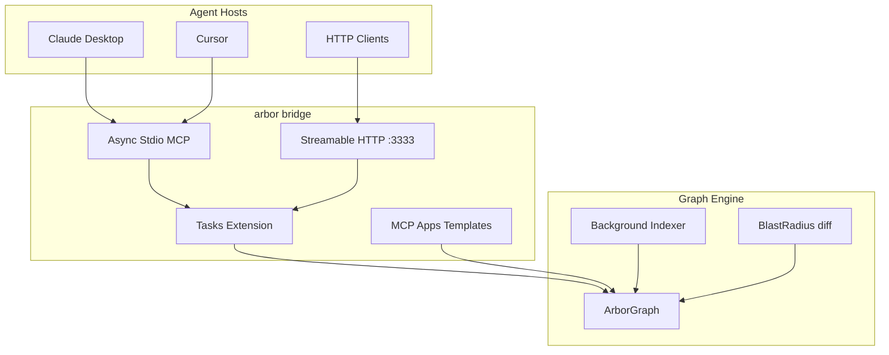

# Arbor v2.4.0 — "The Agent-Native Leap"

> **Release theme:** First code-graph MCP server built for MCP `2026-07-28` — stateless core, Tasks extension, interactive MCP Apps, and credibility benchmarks for growth.

**Target ship date:** July 28, 2026 (aligned with MCP spec RC)

---

## Why 2.4.0

MCP `2026-07-28` is the largest protocol revision since launch: stateless HTTP, extensions framework, redesigned Tasks, and MCP Apps (interactive UIs inside agent hosts). Arbor already has a 15-tool graph MCP server — 2.4.0 makes it the first to ship day-one spec support with an interactive blast-radius graph rendered inside Claude/Cursor.

## Track A — MCP 2026-07-28 Adoption

### A1. Protocol Core Upgrade
- [x] Bump protocol to `2026-07-28` with dual-version fallback for `2025-03-26` clients
- [x] Stateless `_meta` parsing on every request
- [x] `server/discover` endpoint
- [x] `ttlMs` / `cacheScope` on list/read responses
- [x] Extensions capability map (`io.modelcontextprotocol/tasks`, `io.modelcontextprotocol/apps`)

### A2. Streamable HTTP Transport
- [x] `arbor bridge --http [--port 3333]` — stateless HTTP alongside stdio
- [x] `Mcp-Method` / `Mcp-Name` header routing
- [x] Async tokio stdio (replaces blocking stdin loop)

### A3. Tasks Extension
- [x] `tasks/get`, `tasks/update`, `tasks/cancel`
- [x] Long-running ops (indexing, deep audit) return task handles
- [x] Fixes cold-start race (empty graph → task instead of error)

### A4. MCP Apps (SEP-1865)
- [x] Interactive blast-radius graph UI template
- [x] Architecture map UI template
- [x] Tools declare `_meta.ui` resource URIs

### A5. Tool Quality
- [x] Real `get_blast_radius` via git-diff logic (not stub)
- [x] Pagination on `get_map` and `search_symbols`

## Track B — Growth Engine

### B1. Benchmarks
- [x] Criterion benchmark suite (`benches/`)
- [x] Token-savings methodology in BENCHMARKS.md
- [x] CI benchmark workflow

### B2. Launch Assets
- [x] README overhaul (2026-07-28 positioning)
- [x] `agent-card.json` updated
- [x] Launch checklist in `docs/RELEASE_NOTES_v2.4.0.md`

### B3. Release Mechanics
- [x] Version bump 2.3.0 → 2.4.0 across all manifests
- [x] CHANGELOG entry

## Deferred to v2.5.0 — "The Performance Overhaul"

These are intentionally out of 2.4.0 scope to protect the July 28 launch window:

| Epic | Rationale |
|------|-----------|
| Parallel (rayon) indexing | Large refactor; separate release story |
| Incremental PageRank | Requires graph storage redesign |
| Unified parser pipelines | CLI vs sync_server divergence fix |
| Process-level graph daemon | Complements performance epic |

## Execution Order (completed)

1. Roadmap doc (this file)
2. A1 protocol core
3. A3 Tasks extension
4. A5 tool fixes
5. A4 MCP Apps
6. A2 HTTP transport
7. B1 benchmarks
8. B2 launch assets
9. B3 release mechanics

## Success Metrics

| Metric | Target |
|--------|--------|
| MCP spec compliance | `2026-07-28` + legacy `2025-03-26` fallback |
| Tools | 15 (unchanged count, upgraded quality) |
| New transports | stdio + HTTP |
| New extensions | Tasks + Apps |
| Benchmark CI | Green on every PR |
| Launch timing | Same week as MCP spec RC |

## Architecture (2.4.0)

